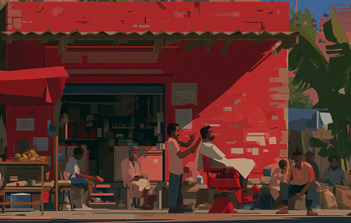
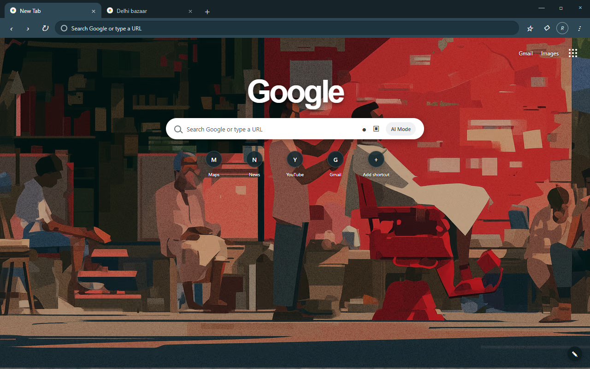

# रेडियो वाला · Radio Wala

<p align="center">
  
</p>

**सिर्फ़ ग़म के गाने.** Sad Hindi songs only — Kumar Sanu, Udit Narayan, Mustafa Zahid, and
the older wounds. A working radio station on the web, plus the Chrome theme the artwork
came from.

> वो आवाज़ जो सीधे दिल तक पहुँचे — the voice that goes straight to the heart.

Two things live in this repository:

| | |
|---|---|
| [`site/`](site) | The radio — a Next.js station that actually plays music |
| root | A Chrome theme built from the same 1980s bazaar illustration |

---

## The radio

57 sad songs across five bands. Which band is on air depends on the hour **in India**, not
on your own clock, because 2am asks for a different kind of sad than the morning does.

| Band | | Window (IST) | FM |
|---|---|---|---|
| उदित नारायण | Udit Narayan | 05:00 – 12:00 | 91.1 |
| कुमार सानू का दर्द | Kumar Sanu Ka Dard | 12:00 – 18:00 | 88.6 |
| मुस्तफ़ा ज़ाहिद | Mustafa Zahid | 18:00 – 22:00 | 93.5 |
| रात के दो बजे | Raat Ke Do Baje | 22:00 – 05:00 | 98.3 |
| पुराने ज़ख्म | Purane Zakhm | on request | 100.7 |

Audio streams from YouTube's embedded player. Nothing is hosted here and rights holders
are paid through YouTube as normal.

### Run it

```bash
cd site && npm install && npm run dev
```

Then open <http://localhost:3000>.

`npm run build` produces a fully static export in `site/out/`, deployable to any host —
there is no server-side code.

### On a phone

- **The screen won't sleep on you.** While a song is playing the station holds a
  [Screen Wake Lock](https://developer.mozilla.org/docs/Web/API/Screen_Wake_Lock_API), so
  the phone doesn't lock itself out from under the player. There's a *Screen stays on*
  toggle under the dial if you'd rather it didn't.
- **Lock screen controls.** Title, film, artwork and play / pause / skip are published via
  the [Media Session API](https://developer.mozilla.org/docs/Web/API/Media_Session_API), so
  they show up on the lock screen, in the notification shade, and on laptop media keys.
- **Installable.** *Add to Home screen* gives it a launcher icon and a chrome-less window.

**What is not possible, honestly:** playback cannot continue once the phone screen actually
locks or you leave the tab. YouTube stops embedded players when they're backgrounded —
background playback is reserved for its own apps. No website can work around that. Hence
the wake lock: the screen staying on is what keeps the music going. On return to the tab,
the player reconciles its state instead of sitting dead.

### Layout

```text
site/
|-- app/
|   |-- layout.tsx          fonts, metadata, viewport, PWA meta
|   |-- page.tsx            nav, hero, footer
|   |-- manifest.ts         installable-app manifest
|   `-- globals.css         palette, grain, grille, slider thumbs
|-- components/
|   |-- Player.tsx          the radio — YouTube IFrame API, dial, transport
|   |-- Station.tsx         player + band cards, kept in sync
|   `-- SongIndex.tsx       searchable song list
|-- lib/
|   |-- rotations.ts        the five bands and their IST windows
|   |-- youtube.ts          IFrame API loader and typings
|   |-- useMediaSession.ts  lock screen metadata and buttons
|   `-- useWakeLock.ts      keep the screen awake while playing
|-- data/songs.ts           GENERATED — do not hand-edit
`-- scripts/
    |-- build-songs.mjs     discover + verify YouTube IDs, write data/songs.ts
    |-- check-embeddable.mjs re-check every shipped ID is embeddable
    `-- build-art.mjs       downscale the illustration, derive icons
```

### Regenerating the song data

`data/songs.ts` is generated, not written by hand. The seed list (title, film, year, band)
lives in `scripts/build-songs.mjs`; the script searches YouTube for each entry, validates
candidates through oEmbed, and reports anything it couldn't resolve rather than silently
dropping it.

```bash
cd site
npm run songs   # rebuild data/songs.ts from the seed list
npm run check   # confirm every shipped ID is actually embeddable
npm run art     # regenerate backdrops, icons and lock-screen artwork
```

`npm run check` exists because oEmbed returns `200` even for videos whose owners have
disabled embedding — that gap would otherwise surface as silence at runtime. The player
also handles it live: IFrame error codes `2, 5, 100, 101, 150` auto-skip to the next track.

Last run: **57/57 verified, 57/57 embeddable, 0 failures.**

---

## The Chrome theme

A cinematic 1980s Delhi bazaar for the New Tab page, in warm afternoon light.



- 3440 × 1204 illustrated New Tab background
- Centered composition for 16:9, 21:9, 3:2 and 4:3 displays
- Walnut and brass tabs and toolbar
- High-contrast controls and labels
- Distinct inactive and Incognito frames
- No permissions, scripts, tracking, or data collection

### Install locally

1. Clone or download this repository.
2. Open `chrome://extensions`.
3. Enable **Developer mode**.
4. Select **Load unpacked**.
5. Choose the repository root — the folder containing `manifest.json`.
6. Open a new tab.

`manifest.json` has to stay at the repository root for *Load unpacked* to work, which is
why the website lives in `site/` rather than alongside it.

Installing a theme replaces the active theme for that Chrome profile. You can restore
another from Chrome settings.

### Layout

```text
.
|-- manifest.json
|-- icons/
|   |-- radio-wala-16.png
|   |-- radio-wala-48.png
|   `-- radio-wala-128.png
|-- images/
|   `-- radio-wala-3440x1204.png
`-- docs/
    |-- radio-wala-screenshot-1280x800.png
    `-- radio-wala-small-promo-440x280.png
```

---

## Credits and rights

Illustration inspired by [saloon.wtf](https://saloon.wtf/). Station structure — bilingual
hero, time-windowed bands, song index — takes its cues from
[deluxesaloon.space](https://www.deluxesaloon.space/); the song list, band names and copy
here are original.

Song credits are compiled from film soundtrack listings. If you hold rights to something
here and want it gone, say so and it goes.

The Chrome Web Store listing predates the rebrand and is still published under the old
name: [Deluxe Saloon](https://chromewebstore.google.com/detail/deluxe-saloon/fhahppndecghgakkgpcfphecjopdkbcd).
